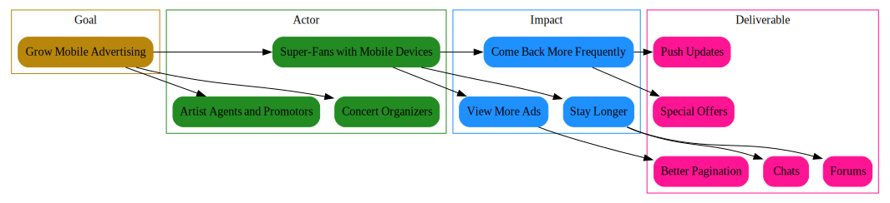

# ImpactMapper

Golang program that makes it easy to build [impact maps](https://www.impactmapping.org/drawing.html) with [graphviz](https://graphviz.org/).

It uses [toml](https://github.com/toml-lang/toml) files parsed by a [toml parser](https://github.com/BurntSushi/toml) to actually build the structures used.

## Modes

The mapper supports two modes, horizontal and vertical. The horizontal mode matches what the impact maps site while the vertical looks more like a tree. You can view examples in the [Examples folder](examples/). The mode is determined by checking the `mode` field in the map.toml.

## Development

This project utilizes the new [Go modules](https://github.com/golang/go/wiki/Modules) feature introduced in Go 1.11 and as a result at least this version is required for development. You just need to clone this repo and develop as usual.

## Using The Tool

Building the tool is as simple as running a build in the root of the repository:

`go build`

which will create an `impactmapper` binary that matches your operating system. You can then run the tool to be provided an example toml file you can edit to match the structure you wish to you.

You will then simply run the `impactmapper` binary in the same directory as the `map.toml` and it will generate a graphviz compatible dot file. You can use any compatible previewer such as [Graphviz Interactive Preview](https://marketplace.visualstudio.com/items?itemName=tintinweb.graphviz-interactive-preview) for VSCode.

You will get a resulting file with something similar to the following:

